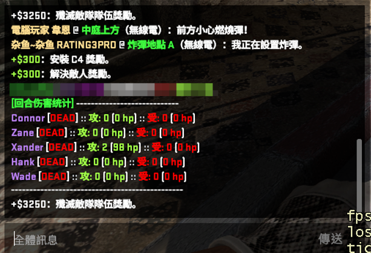

# 回合结束伤害统计 (Sourcemod)

适用于 CS:GO 的 SourceMod 插件，在每回合结束时在聊天栏自动显示详细的伤害统计数据。

## 功能特点

- **回合总结**：回合结束时自动显示伤害报告。
- **双向统计**：显示你对敌人的命中次数/伤害，以及敌人对你的命中次数/伤害。
- **实时状态**：显示敌人当前的剩余血量或死亡状态（[34 HP] 或 [DEAD]）。
- **全员显示**：列出所有敌对阵营玩家的数据，无论是否有交火。
- **颜色区分**：使用 CS:GO 聊天颜色进行区分（造成伤害为绿色，受到伤害为红色）。

## 安装说明

1.  **编译插件**：
    *   将 `round_damage.sp` 拖放到 `spcomp.exe`或使用 `./spcomp round_damage.sp` （包含在 SourceMod 脚本包中）上进行编译。
2.  **上传文件**：
    *   将编译生成的 `round_damage.smx` 文件放入服务器的 `csgo/addons/sourcemod/plugins/` 目录中。
3.  **加载插件**：
    *   更换地图或在服务器控制台运行 `sm plugins reload round_damage.smx`。

## 配置说明

插件首次运行后，会自动在 `csgo/cfg/sourcemod/plugin.round_damage_report.cfg` 生成配置文件。

| ConVar | 默认值 | 描述 |
| :--- | :--- | :--- |
| `sm_dmgreport_enabled` | `1` | 启用或禁用本插件 (1=启用, 0=禁用)。 |

## 截图示例

